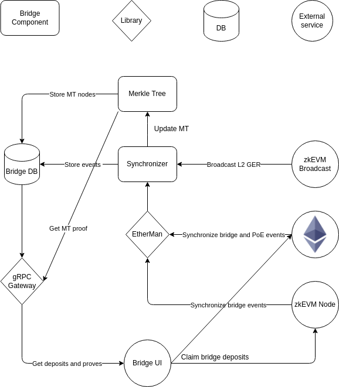

# zkEVM Bridge service

This repo implements a backend service written in Go, that enables clients, like the [web UI](https://github.com/0xPolygonHermez/zkevm-bridge-ui),
to interact with the [bridge smart contract](https://github.com/0xPolygonHermez/zkevm-contracts) by providing Merkleproofs.

## Architecture

  

## Running the bridge service

- [Running locally](docs/running_local.md)

